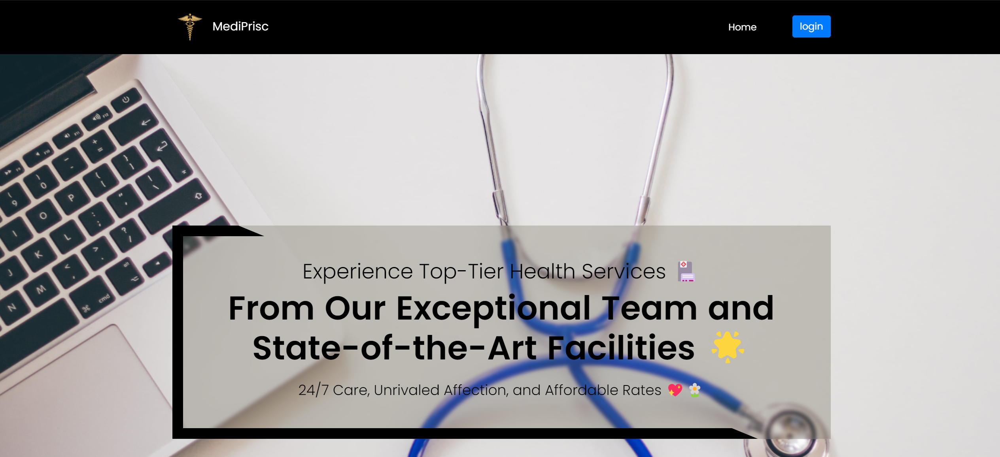
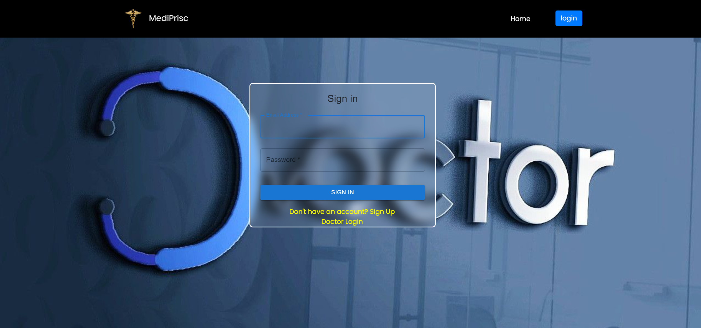
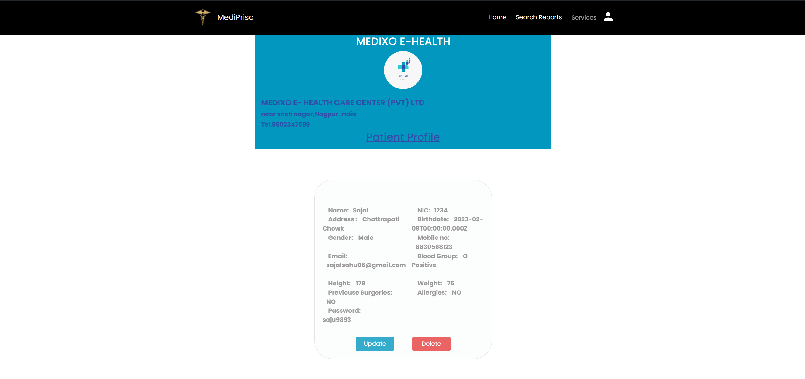
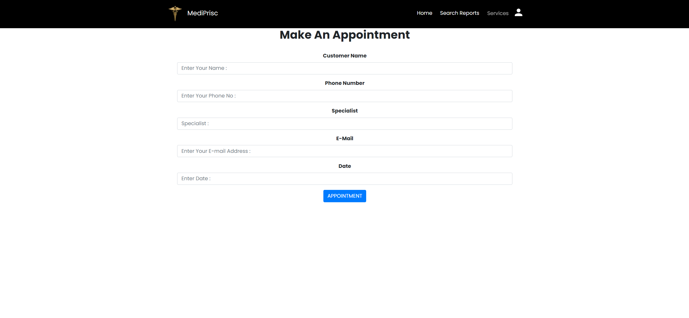

# HOSPITAL-MANAGEMENT-SYSTEM

## Overview

A comprehensive Hospital Management System developed using the MERN Stack (MongoDB, Express.js, React.js, Node.js). This application streamlines the management of hospital operations, including patient registration, appointment scheduling, staff management, and more.

## Features

### Front-End

* Sign-In & Sign-Up Pages: Secure user authentication using JWT tokens.

* Role-Based Access Control: Different user roles like Admin, Doctor, and Patient with specific permissions.

* Patient Dashboard: Displays patient information, medical history, appointments, and billing details.

* Doctor Dashboard: Allows doctors to manage their appointments, view patient records, and update treatment plans.

* Appointment Scheduling: Patients can book, view, and manage appointments with available doctors.

*Medical Records Management: Doctors can add, view, and update patient medical records.

*Responsive Design: Optimized for both desktop and mobile devices.

### Back-End

* Express.js: Manages server-side operations and API routes.

*  MongoDB Atlas: Stores patient records, appointments, and user data in a scalable, cloud-based database.


## Screenshots

### Landing Page:


### Sign-In Page:


### Patient Dashboard:


### Appointment Scheduling:



## Developed With

* [Visual Studio Code](https://code.visualstudio.com/) - A source code editor developed by Microsoft for Windows, Linux and macOS. It includes support for debugging, embedded Git control, syntax highlighting, intelligent code completion, snippets, and code refactoring
* [Node.js](https://nodejs.org/en/) - Javascript runtime
* [React](https://reactjs.org/) - A javascript library for building user interfaces
* [Babel](https://babeljs.io/) - A transpiler for javascript
* [Webpack](https://webpack.js.org/) - A module bundler
* [SCSS](http://sass-lang.com/) - A css metalanguage
* [Bootstrap 4](https://getbootstrap.com/) - Bootstrap is an open source toolkit for developing with HTML, CSS, and JS
* [Axios](https://github.com/axios/axios) - Promise based HTTP client for the browser and node.js
* [Express js](http://expressjs.com/) - Express is a minimal and flexible Node.js web application framework that provides a robust set of features for web and mobile applications.
* [MongoDB atlas](https://www.mongodb.com/cloud/atlas) - MongoDB Atlas is the global cloud database service for modern applications.
* [Passport Js](http://www.passportjs.org/) - Passport is authentication middleware for Node.js. Extremely flexible and modular, Passport can be unobtrusively dropped in to any Express-based web application.

### Prerequisites

Ensure that you have the following software installed on your system:

Node.js 14.x or higher
npm 6.x or higher
You can verify the versions using the following commands:

Type the following commands in the terminal to verify your node and npm versions

```bash
node -v
npm -v
```

### Install

Follow the following steps to get development environment running.

* Clone _'MERN-BUS-APP.git'_ repository from GitHub

  ```bash
  git clone [https://github.com/SajalSahu06/hms-frontend2.git]
  ```

   _OR USING SSH_

  ```bash
  git clone git@github.com:SajalSahu06/hms-frontend2.git
    
  ```

* Install node modules

   ```bash
   cd hms-frontend2
   cd frontend
   npm install

   ```


### Starting both front end and back end servers

* Build application

  This command will start the mongodb and the front end part.

  ```bash
  cd frontend
  npm start
  cd..
 
  ```


---

